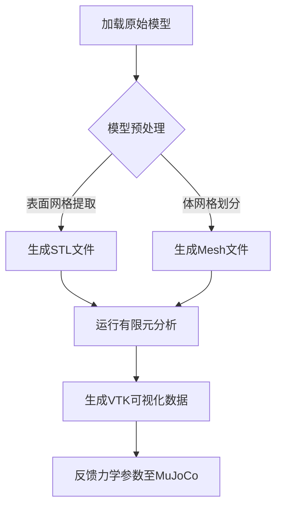

# Mujoco-FEM 联合接触仿真系统

## 项目概述
本系统实现基于Mujoco物理引擎与Sfepy有限元分析的协同仿真框架，能够主要特征包括：
- 实时刚体动力学仿真与可视化
- 动态表面网格生成与四面体化
- 基于惩罚函数法的接触力计算
- FEM--->Mujoco力反馈耦合机制 （Mujoco (刚体动力学) ↔ 中间数据层 ↔ Sfepy (柔性体力学分析)）

本仿真的具体描述如下：
## 更新日志
### v1.1 主要改进 (2025/2/29)
- 增强网格处理：增加STL边界坐标自动检测
- 改进接触条件：基于实际网格几何的特征识别
- 优化材料参数：调整杨氏模量至2e10 Pa
- 修正力方向：修复接触力施加方向错误

## 目录架构概览
```bash
# 项目根目录结构
├── MujocoModels/          # 原始几何模型（自由落体范例）
│   ├── boxm.STL           # 静态障碍物模型（刚性盒子）
│   └── pan.STL            # 动态下落物体模型（平底锅）
│
├── model/                # 运行时数据与中间结果
│   ├── stl/               # 瞬时表面网格文件（离散化几何体）
│   ├── mesh/              # 体网格文件（数值模拟基础）
│   └── vtk/               # 可视化结果（三维流场/应力分布）
│
└── main.py                # 主程序入口（控制仿真流程）
```

# 快速开始 
环境配置
```bash
conda create -n MujocoFEM python=3.9
conda activate MujocoFEM
pip install -r requirements.txt
# requirements.txt 需要按照的依赖 (基于WINDOWS)
mujoco==3.2.7
sfepy==2024.4
tetgen==0.6.4
meshio>=5.3.4
numpy>=1.21.0
mujoco_viewer>=0.1.3

python contact.py --steps 5000
```
# 算法存在不足和改进方向
  1. Mujoco中接触条件的判断问题；目前算法采用的是较为简单的几何体，且是否接触采用估算等粗鲁的方法进行，这样肯定会导致仿真的不准确，因此，未来需要使用更高级的算法去判断是否接触，以及提取接触的具体顶点。
  2. FEM接触模型的问题；本算法使用SFEPY工具库进行有限元，尚未验证和熟练使用其内部的接触数学模型，所以结果不是很准确，且使用的是罚函数的基础方法，未来需要验证和使用更加准确的物理模型，比如拉格朗日方法等等。且需要验证是否能在SFEPY中使用。

## 目前已知可能存在的典型问题排查
| 现象	         | 可能原因      | 解决方案   |
|-------------------|------------|-----------|
| 网格生成失败 | STL文件非流形      | 使用MeshLab/Gmsh修复模型    |
| 接触力震荡 | 惩罚刚度不足     |逐步增加.epss参数     |
| 仿真速度骤降 | 网格过度细化      | 调整a0.001为a0.01       |
| VTK结果异常 | 节点编号偏移错误     | 检查merge_mesh的逻辑     |

